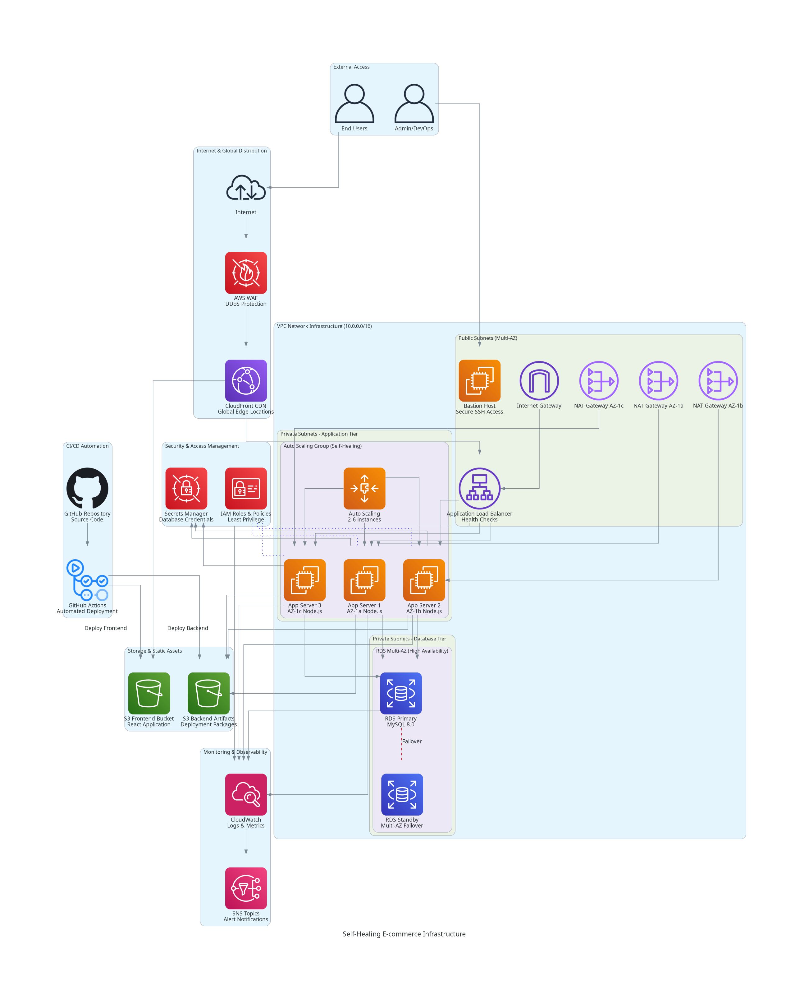

# Self-Healing E-commerce Infrastructure

I built this complete 3-tier e-commerce infrastructure to learn how enterprise applications scale and heal themselves automatically. This project taught me how companies like Amazon and Netflix handle millions of users without manual intervention.

## Why I Built This

During my cloud learning journey, I wanted to understand what "self-healing" really means in production environments. I discovered it's not just about auto-scaling - it's about building systems that detect problems, fix themselves, and maintain performance without human intervention.

## What It Does

This infrastructure automatically:
- **Scales up** when traffic increases (detected via CPU/memory metrics)
- **Heals itself** when instances fail (replaces unhealthy instances automatically)
- **Maintains availability** across multiple zones (survives datacenter failures)
- **Optimizes costs** by scaling down during low traffic
- **Monitors everything** with real-time alerts and dashboards

## Architecture



**3-Tier Design:**
- **Frontend**: React app served via CloudFront CDN + S3
- **Backend**: Node.js API running on auto-scaling EC2 instances behind ALB
- **Database**: RDS MySQL with Multi-AZ failover (production)

**Self-Healing Components:**
- Auto Scaling Groups with health checks
- Application Load Balancer with target health monitoring
- RDS Multi-AZ for database failover
- CloudWatch alarms triggering automated responses

**Data Flow:**
```
Users → CloudFront CDN → ALB → Auto Scaling Group → RDS Multi-AZ
                                     ↓
                            CloudWatch Monitoring & Alerts
```

## Tech Stack & Why I Chose Each

| Component | Technology | Why This Choice |
|-----------|------------|-----------------|
| **Infrastructure** | Terraform | Reproducible, version-controlled infrastructure |
| **Frontend Hosting** | S3 + CloudFront | Global CDN performance, cost-effective |
| **Backend Runtime** | EC2 Auto Scaling | Learn instance management and scaling |
| **Load Balancing** | Application Load Balancer | Health checks and traffic distribution |
| **Database** | RDS MySQL Multi-AZ | Managed service with automatic failover |
| **Security** | VPC + WAF + Security Groups | Defense in depth approach |
| **Monitoring** | CloudWatch + Performance Insights | Complete observability stack |
| **CI/CD** | GitHub Actions | Automated testing and deployment |

## Multi-Environment Strategy

I implemented separate dev and production environments to understand real-world deployment practices:

### Development Environment
- **Cost-optimized** for learning and testing
- Single AZ deployment (acceptable downtime)
- Smaller instances (t3.micro)
- Minimal auto-scaling (1-2 instances)
- 7-day backup retention

### Production Environment  
- **High-availability** configuration
- Multi-AZ RDS deployment (zero downtime failover)
- Better performance (t3.small instances)
- Enhanced auto-scaling (2-6 instances)
- 30-day backup retention + Performance Insights
- Deletion protection enabled

## Project Structure

```
Self-Healing-Ecommerce-Web-App/
├── terraform/                    # Infrastructure as Code
│   ├── modules/                  # Reusable components
│   │   ├── vpc/                 # Network infrastructure
│   │   ├── ec2/                 # Auto-scaling compute
│   │   ├── rds/                 # Database with failover
│   │   ├── cloudfront/          # CDN and caching
│   │   └── security/            # WAF and security groups
│   ├── environments/            # Environment-specific configs
│   │   ├── dev/                 # Development settings
│   │   └── prod/                # Production settings
│   └── main.tf                  # Root configuration
├── source/                      # Application code
│   ├── frontend/                # React application
│   └── backend/                 # Node.js API
├── .github/workflows/           # CI/CD automation
│   ├── develop.yml             # Development pipeline
│   └── main.yml                # Production deployment
└── generated-diagrams/         # Architecture visuals
```

## Real-World Learning Outcomes

### Technical Skills Gained
- **Infrastructure as Code**: Managing complex AWS environments with Terraform
- **Auto-Scaling Architecture**: Designing systems that respond to load automatically
- **Multi-AZ Deployments**: Implementing true high availability
- **Security Best Practices**: VPC design, WAF rules, least-privilege IAM
- **CI/CD Pipelines**: Automated testing and deployment workflows
- **Monitoring & Alerting**: Proactive system health management

### Business Understanding
- **Cost Optimization**: Balancing performance with operational costs
- **Risk Management**: Designing for failure scenarios
- **Compliance**: Implementing security controls and audit trails
- **Operational Excellence**: Reducing manual intervention and human error

## Deployment Options

### Quick Start (Development)
```bash
# Deploy cost-optimized development environment
cd terraform
terraform init
terraform plan -var-file="terraform.tfvars.dev"
terraform apply -var-file="terraform.tfvars.dev"
```

### Production Deployment
```bash
# Deploy high-availability production environment
cd terraform
terraform init
terraform plan -var-file="terraform.tfvars.prod"
terraform apply -var-file="terraform.tfvars.prod"
```

### Using CI/CD Pipeline
1. Push changes to `develop` branch
2. Pipeline validates and creates auto-PR to `main`
3. Review and merge PR
4. Production deployment triggers automatically

## Cost Analysis

### Development Environment (~$88-101/month)
- **EC2**: $7-15 (1-2 t3.micro instances)
- **RDS**: $15 (db.t3.micro, single AZ)
- **ALB**: $16 (load balancer)
- **NAT Gateways**: $45 (3 gateways for AZ coverage)
- **Other**: $5-10 (S3, CloudFront, monitoring)

### Production Environment (~$136-201/month)
- **EC2**: $30-90 (2-6 t3.small instances)
- **RDS**: $30 (db.t3.small, Multi-AZ)
- **ALB**: $16 (load balancer)
- **NAT Gateways**: $45 (3 gateways)
- **Enhanced Monitoring**: $5 (Performance Insights)
- **Other**: $10-15 (S3, CloudFront, WAF)

## Challenges I Solved

### Auto-Scaling Tuning
**Problem**: Initial auto-scaling was too aggressive, causing cost spikes.
**Solution**: Implemented gradual scaling policies with cooldown periods and multiple metrics (CPU + memory).

### Database Connection Pooling
**Problem**: New instances couldn't handle database connection limits during scaling events.
**Solution**: Implemented connection pooling in the application and optimized RDS connection limits.

### Health Check Optimization
**Problem**: Instances were marked unhealthy during legitimate high-load periods.
**Solution**: Tuned health check intervals and thresholds, added application-level health endpoints.

### Cross-AZ Latency
**Problem**: Database queries from different AZs had inconsistent performance.
**Solution**: Implemented read replicas and optimized connection routing.

## Monitoring & Observability

### Key Metrics I Track
- **Application Performance**: Response times, error rates, throughput
- **Infrastructure Health**: CPU, memory, disk usage across all instances
- **Database Performance**: Connection counts, query performance, replication lag
- **Cost Optimization**: Instance utilization, scaling events, cost per transaction

### Alerting Strategy
- **Critical**: Database failover, all instances down, security breaches
- **Warning**: High CPU sustained >5 minutes, scaling events, elevated error rates
- **Info**: Deployment completions, cost threshold notifications

## Security Implementation

### Network Security
- **VPC Design**: Private subnets for application and database tiers
- **Security Groups**: Least-privilege access rules
- **NACLs**: Additional network-level protection
- **WAF**: Protection against common web attacks

### Application Security
- **Secrets Management**: AWS Secrets Manager for database credentials
- **IAM Roles**: Instance profiles with minimal required permissions
- **Encryption**: At-rest and in-transit encryption for all data
- **Bastion Host**: Secure administrative access

## What's Next

### Planned Enhancements
- **Container Migration**: Move to ECS/Fargate for better resource utilization
- **Microservices**: Break monolithic API into domain-specific services
- **Caching Layer**: Add ElastiCache for improved performance
- **Advanced Monitoring**: Implement distributed tracing with X-Ray

### Scaling Considerations
- **Global Deployment**: Multi-region setup for international users
- **CDN Optimization**: Advanced CloudFront configurations
- **Database Sharding**: Horizontal scaling strategies
- **Cost Optimization**: Reserved instances and Spot fleet integration


This project demonstrates my understanding of:

### System Design
- **Scalable Architecture**: Designing systems that grow with demand
- **Fault Tolerance**: Building resilience into every component
- **Performance Optimization**: Balancing speed, cost, and reliability

### DevOps Practices
- **Infrastructure as Code**: Reproducible, version-controlled infrastructure
- **CI/CD Automation**: Reliable, automated deployment pipelines
- **Monitoring**: Proactive system health management

### Business Acumen
- **Cost Management**: Understanding the financial impact of architectural decisions
- **Risk Assessment**: Planning for failure scenarios and business continuity
- **Operational Excellence**: Reducing manual processes and human error

## Documentation

- **[AWS Console Guide](doc/aws_console_step_by_step_guide.md)**: Manual setup instructions
- **[Troubleshooting Guide](doc/troubleshoot.md)**: Real-world challenges and solutions
- **[Terraform Guide](terraform/README.md)**: Infrastructure deployment details
- **[Architecture Diagrams](generated-diagrams/)**: Visual system representations

## Getting Help

If you're learning from this project:
1. Check the troubleshooting sections in the documentation
2. Review CloudWatch logs and metrics for debugging
3. Use the bastion host for secure system investigation
4. Feel free to open issues for questions or improvements

---

**Built with passion for learning cloud architecture and DevOps best practices. This project represents my journey from understanding basic AWS services to implementing enterprise-grade, self-healing infrastructure.**

⭐ **Star this repo** if it helps your cloud learning journey!
